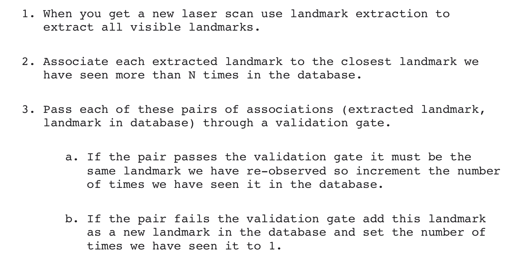

## Landmark Extraction Algorithm

### Spike

- extract extrema in the scan readings to be used as landmarks
- doesn't perform well in smooth environments
- not robust against people since they would be picked up as spikes in the scan

### RANSAC

- Random Sampling Consesus
- extract lines from a scan to be used as landmarks
    - actually the lines are further transformed into point landmarks that are easier to work with
- performs well in walled indoor environments with lots of straight lines
- robust against people in the scans
- how it works:
    - take random sample of points from the scan
    - least squares approximation for best fit line through the readings
    - if number of points in the scan that are close to the line > threshold we have reached a consensus that a line/wall-segment has been seen
- seen SLAM for Dummies pg 21 for pseudo-code for implementing

## Data Association Algorithm

- matching observed landmarks from different laser scans with each other (re-observing landmarks)
- problems that can arise:
    - landmarks might not be re-observed at every timestep
    - identified landmark at one timestep may never be seen again
    - a landmark might be wrongly associated with a previously seen landmark (very bad b/c leads robot to wrong belief in its position)
- data-assocation policy:
    - only use landmarks that have been seen $N$ times to eliminate bad ones messing up the calculations
    - Nearest-Neighbor Approach: 
        - can use euclidean (works fine for RANSAC which yields landmarks far enough apart) or mahalanaobis distance
    - 
